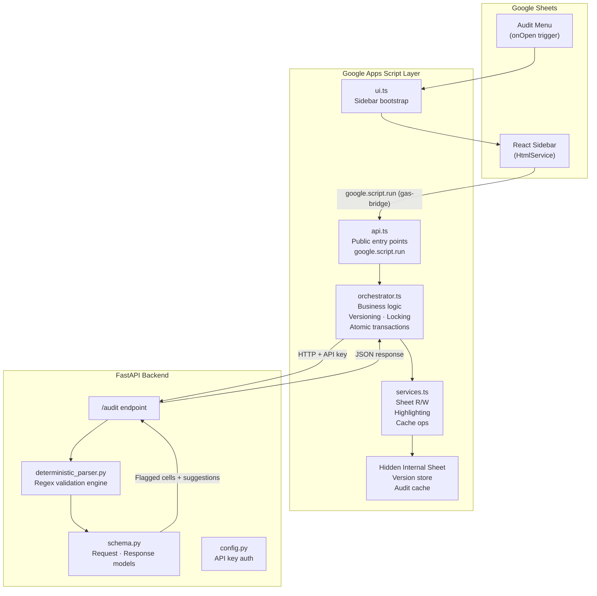
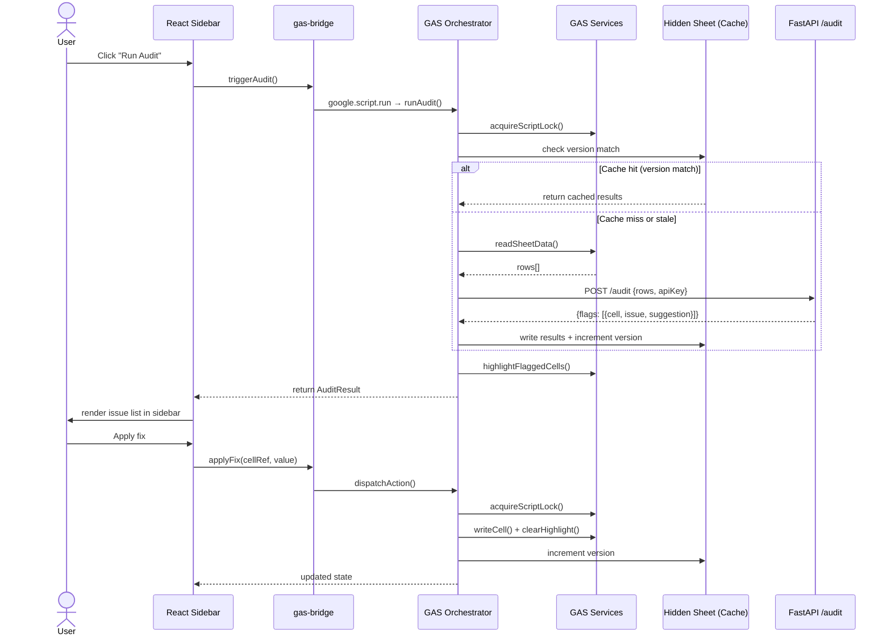
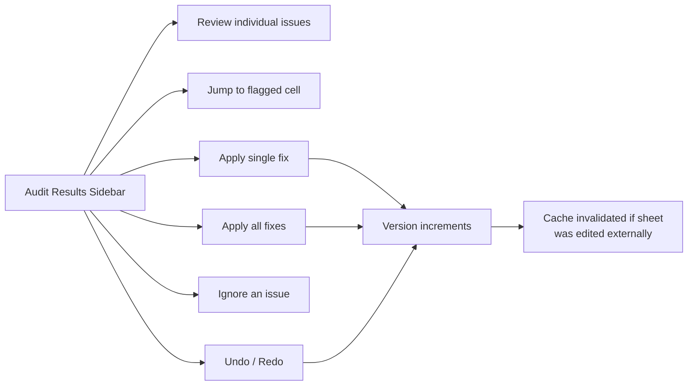

# Audio Transcript Audit Tool

> A Google Sheets plugin for validating audio transcripts against internal formatting and style guidelines. Built as a freelance tool for a transcription company.

---

## What Problem Does This Solve?

Transcription audit teams work directly inside Google Sheets. Each row is a transcript segment carrying fields like speaker, timestamps, language, accent, emotion tags, and the transcript text itself.

At scale, inconsistencies are inevitable — a misformatted timestamp here, a style violation there. Catching them manually is slow, error-prone, and pulls auditors away from higher-value review work.

This tool plugs directly into the spreadsheet they're already working in. One click from an **Audit** menu triggers a validation run. Flagged issues surface in a sidebar. Each one can be fixed individually, fixed all at once, ignored, or undone — without ever leaving the sheet.

---

## Architecture Overview



---

## Data Flow — An Audit Run



---

## Stack

| Layer | Technology | Notes |
|---|---|---|
| **Spreadsheet host** | Google Sheets | Where auditors live day-to-day |
| **Plugin runtime** | Google Apps Script | Sidebar injection, sheet R/W, script locks |
| **UI framework** | React + TypeScript | Compiled to a single HTML file via `vite-plugin-singlefile` |
| **Build tool** | Vite + clasp | `clasp push` deploys to GAS |
| **Backend** | FastAPI (Python) | Single `/audit` endpoint, API key protected |
| **Validation** | Regex engine | Deterministic, rule-based, fully testable |

---

## Project Structure

```
audio-transcript-audit-tool/
│
├── client/                          # React + Google Apps Script
│   ├── src/
│   │   ├── client/                  # React sidebar
│   │   │   ├── components/          # UI components
│   │   │   └── hooks/
│   │   │       ├── useAudit.ts      # Main state machine
│   │   │       └── useHistory.ts    # Undo/redo stack
│   │   ├── server/                  # Google Apps Script
│   │   │   ├── services.ts          # Sheet + cache operations
│   │   │   ├── orchestrator.ts      # Business logic layer
│   │   │   ├── api.ts               # Public GAS entry points
│   │   │   └── ui.ts                # onOpen, sidebar bootstrap
│   │   └── global.d.ts              # Shared types
│   ├── vite.config.ts
│   └── package.json
│
└── server/                          # FastAPI backend
    └── app/
        ├── engine/
        │   └── deterministic_parser.py   # Regex validation core
        ├── main.py
        ├── routes.py
        ├── schema.py
        ├── config.py
        └── utils.py
```

---

## Key Design Decisions

### GAS as the Orchestrator

An early version had React coordinating versioning, cache writes, and highlight state across multiple sequential `google.script.run` calls. The problem: each call is async and GAS doesn't queue them — race conditions and partial state updates were guaranteed.

The rework pushed all of that into a single `dispatchAction` function on the GAS side, wrapped in a script lock. React now only manages UI state. The sheet is the source of truth, and every mutation that touches it is atomic.

### Deterministic Validation

The validation domain is well-defined: every rule in a transcription style guide can be expressed as a pattern. Regex handles this better than a probabilistic model — it's explicit, deterministic, fast, and every rule is independently testable. No inference, no surprises.

### Single-File Client Build

`vite-plugin-singlefile` inlines all JavaScript and CSS into a single HTML file at build time. This is a hard requirement for GAS `HtmlService`, which cannot load external assets or make requests to external origins from the injected sidebar.

### Version Tracking

Every sheet mutation increments a version number stored in a hidden internal sheet. Audit results are cached alongside the version they were generated against. On sidebar load, if the current sheet version doesn't match the cached audit version, the cache is discarded and the user is prompted to re-run the audit. This prevents stale suggestions from being applied to a sheet that was edited after the last audit.

---

## Sidebar Capability Map



---

## Setup (Reference Only)

This project requires:

1. A configured Google Sheet with the expected column schema
2. [clasp](https://github.com/google/clasp) credentials linked to your GAS project
3. Script Properties set in the GAS editor:
   - `API_BASE_URL` — URL of the running FastAPI server
   - `API_KEY` — shared secret for the `/audit` endpoint

```bash
# Install dependencies
cd client && npm install

# Build and push to GAS
npm run build
clasp push
```

```bash
# Run the FastAPI server
cd server
pip install -r requirements.txt
uvicorn app.main:app --reload
```

> **Note:** This project was discontinued before reaching production. The repo exists as a reference and portfolio piece. Credentials and sheet configuration are not included.

